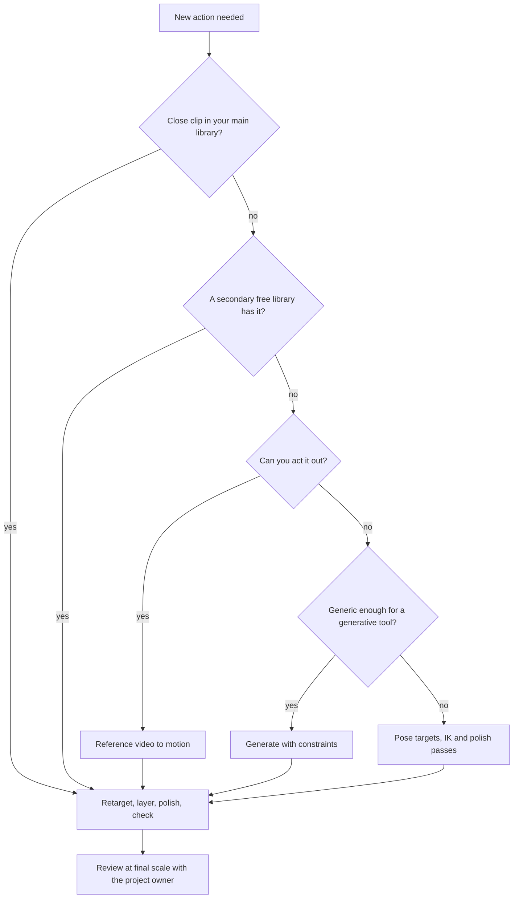

# Animation playbook for a shared rig

This covers **how** to animate a shared humanoid (or similar) rig with an LLM agent doing the
editing. What a given unit or character actually is, wears and does is design work and belongs in
your own project's design docs, not here. Read [PROCESS.md](PROCESS.md) for the review loop this
plugs into, and [GEAR.md](GEAR.md) for sockets, loadouts and grips.

## 1. The rule that fixes "robotic"

**Motion comes from a whole-body source. An agent edits motion; it never builds a move one joint
at a time from a text description.**

Words are for **choosing** a source and **editing** it, never for generating motion from nothing.
The evidence:

- **The research systems that work don't let a language model write joint rotations directly:**
  - Re²MoGen (arXiv [2604.17807](https://arxiv.org/abs/2604.17807), 2026) has the model plan only
    the pelvis, wrists and ankles as a few keyframes. A learned pose model fills in the body, a
    motion model fills the frames between, and a physics stage removes foot sliding and ground
    penetration.
  - Goel et al., *Iterative Motion Editing with Natural Language* (SIGGRAPH 2024,
    [arXiv 2312.11538](https://arxiv.org/abs/2312.11538)) has the model call a small set of edit
    operations on an existing motion instead of generating one from scratch.
- **Language models understand movement in general, not in detail.** Li et al. (EMNLP 2025
  Findings, [arXiv 2505.21531](https://arxiv.org/abs/2505.21531)) found them "strong at
  interpreting high-level body movements" but struggling "with precise body part positioning" and
  with multi-step movements.

**Before starting any new action, answer five questions in the action's notes:**

1. Which slot does it fill, how many frames does it have, and on which frame does the key moment
   (a hit, a release, a footstep) land?
2. What is the whole-body source ([section 4](#4-where-motion-comes-from))?
3. Which body regions get offsets, and how much of the donor's motion does each keep?
4. What are the contacts (planted feet, grips, the ground)?
5. What must read at the smallest scale this will actually be seen at?

## 2. Why motion reads as robotic

These are recurring mistakes, each one easy to fall into with a quick proof-of-concept and each
one worth deliberately avoiding once you're past the proof stage:

| What you see | Why it happens | Fix |
|---|---|---|
| Only one limb moves | A script resets every bone to a standing pose each frame, then solves only the moving limb | Start from a whole-body donor clip and animate the held object first, then let the body follow ([5.3](#53-layer-offsets-onto-the-donor-dont-overwrite-it), [5.4](#54-weapons-shields-and-other-props)) |
| The legs walk under a frozen torso | A script copies the standing pose onto the whole spine on every frame | Keep a share of the donor's upper-body sway, layered as an offset on top of the carry pose ([5.3](#53-layer-offsets-onto-the-donor-dont-overwrite-it)) |
| Joints all start and stop together | Every phase uses the same ease curve, so nothing leads or lags | Stagger joints from hips to hand, add anticipation and overshoot, vary the easing ([5.5](#55-polish-passes)) |
| The hand and fingers warp | Rotating finger bones, or twisting a skinned forearm in place | Never key finger bones on a rig not built for it; use fixed grip poses; consider mitten hands with no finger bones for anything seen at small scale ([5.4](#54-weapons-shields-and-other-props)) |
| Raw library motion distorts the shoulders | The donor library's rest pose differs from your rig's | Check rest orientations and retarget in world space, not by copying local rotations ([5.2](#52-retarget-library-motion-onto-your-rig)) |
| A held object clips through the ground in a fall/death | A raw death clip still has the object bone-parented through the impact | Release held objects before impact, clamp them to the ground, pose the landing explicitly ([5.4](#54-weapons-shields-and-other-props)) |
| A hitch at a walk's loop point | The donor crosses a foot-contact transition exactly at the loop seam | Label contact phases, correct planted-marker drift, then review the seam at full speed, not just frame by frame ([5.7](#57-automatic-checks)) |

## 3. How to describe a move

The project owner never needs to give joint angles, frame numbers or bone names. There are four
ways to say what a move should be. Use the lightest one that works.

### 3.1 Pick a starting clip

Keep a **donor catalogue**: every action from your motion libraries, rendered on your own shared
rig, so a non-technical reviewer can point at one instead of describing motion in the abstract.

- **Where:** a `review/donor_catalog/` folder. One image per clip, plus an index listing every
  clip with its thumbnail, frame count, and whether it loops.
- **Each image:** several evenly spaced frames in a row from a three-quarter view, plus the same
  frames from your actual in-engine camera at real on-screen size, enlarged without smoothing so
  small detail stays visible. Label each image with the clip name and source library.
- **Retarget:** a quick, unpolished retarget is fine here - the catalogue is only for choosing.

The reply can be as short as: *"Attack: start from `Punch_Jab`, but holding a spear."*

### 3.2 Fill in a brief card

Copy this card into chat or into the unit's notes. Plain language is fine; the agent turns it into
a detailed phase table and reads it back before building anything.

```text
Unit and animation:   <unit> - <action>
Start from:           <library clip name>   (or: a reference video, with a timestamp)
Must read at scale:   <the one thing that must be unambiguous even small/far away>
Phases (one line each):
  1. Ready     - <starting pose>
  2. Wind-up   - <how it winds up>
  3. Strike    - <the key moment>
  4. Recover   - <how it settles back>
Must not:             <specific failure modes to avoid>
Loops?                <yes/no>
```

### 3.3 Change a move with edit words

After a first version exists, answer with **edit words** that name a phase and a body part. Each
one maps to a single operation the agent can run and undo, so every change is exact.

| Say | Meaning | What the agent does |
|---|---|---|
| **bigger / smaller** *[part]* in *[phase]* | Exaggerate or calm the motion | Scales that part's movement away from its pose at the start of the phase |
| **faster / slower** *[phase]* | Change speed | Retimes only that phase; contacts stay planted |
| **hold** *[phase]* for a moment | Linger on a pose | Adds 1-3 held frames at the end of the phase |
| **earlier / later** *[part]* | Change the order parts move in | Shifts that chain's timing by 1-2 frames |
| **lean** forward / back / left / right | Change the upper-body angle | Adds an offset to the spine and pelvis, spread over the spine bones |
| **step** with the left / right foot | Add or move a step | Moves that foot's target; the foot stays planted before and after |
| **raise / lower** *[hand, weapon, shield]* | Move an end point | Moves that hand's target; the arm follows by IK |
| **turn** *[hips, chest, head]* toward / away | Twist | Adds a twist offset to that region |
| **keep** *[part]* **still** | Freeze one region | Holds that region at its current pose for the phase |
| **more weight on** *[foot]* | Shift balance | Moves the pelvis over that foot |
| **blend into** *[clip]* at *[phase]* | Swap the ending | Crossfades into another clip over 3-6 frames |
| **mirror** | Swap sides | Mirrors the action left to right (only for units without a fixed handedness) |

Standard phase names: **ready, wind-up, strike, hit, follow-through, recover** for an attack;
**contact, passing, up, down** for the steps of a loop, and **in, out** for breathing on an idle.

**Point at moments, not frames.** "When the weapon is furthest forward", "as the left foot lands"
and "at the top of the swing" are exact, and they survive retiming, because the agent finds these
moments in the motion itself (a hand at its furthest point, a foot at its lowest).

**As operations, inside the agent's own scripts,** each edit word becomes one call from a small
fixed set:
- `rotate_joint(joint, flex|extend|abduct|adduct, amount, phase)`
- `translate_joint(hand|foot|pelvis, forward|back|up|down|left|right, amount, phase)`
- `relative_to(joint_a, joint_b, towards|above|below|in_front|contact, phase)`
- `change_speed(fast|slow|hold, phase)`
- `fix_joint(joint, where, phase)`

Amounts are fractions of the joint's range of motion, not raw angles. Every call is eased in and
out over its phase, so no edit can create a snap.

### 3.4 Show it instead of telling it

Some moves are faster to act out than to describe: a throw, a strike from behind a shield, a bow
draw, a fall. For those, film a reference clip.

**How to film:**
- **Camera:** phone sideways (landscape), steady on a shelf or chair at about hip height, 3-4 m
  away. Keep the whole body in frame the whole time, feet included, with space above the head.
- **Background and light:** plain wall, even light, clothes that contrast with the wall, nothing
  loose or flowing that would confuse a motion-from-video tool.
- **Props:** a broom handle for a spear or lance, a lid for a shield, a rolled towel for a javelin.
  Mime any throw rather than letting go indoors.
- **Takes:** stand still for about a second, do the move, then stand still again. Do 3 takes.
- **Angles:** one take from the side (90 degrees) is the most useful on its own. A second angle
  from the front three-quarter helps with twists.
- **Files:** name them `unit_move_take.mp4` and keep raw reference footage of real people out of
  git - it's personal footage, not an asset, and it doesn't need to be redistributed. Record only
  the file name and the conversion tool used in the action's provenance notes.

Convert the video to motion with a tool from [section 7](#7-tools-and-licences) and retarget it
like a library clip. If conversion fails, the video is still the best brief there is - take the
key poses and timing from it by eye.

**Single key poses:** a photo of someone holding the pose, or a screenshot from a free posing app
(section 7), is enough for an idle, a guard stance or a death landing.

### 3.5 Review rounds

Each round, send back:

1. **A sprite/asset sheet:** every facing at real on-screen size (enlarged without smoothing), one
   column per key frame. This is the image that decides whether the move reads at final scale.
2. **A preview clip:** a larger three-quarter view at real playback speed, looped a few times
   (`tools/review_render.py` covers this).
3. **A short changes note:** at most 5 lines on what changed since the last round, plus the check
   results from [5.7](#57-automatic-checks).

The reviewer answers with edit words or an updated brief card, naming phases, not frame numbers.
Each round is one batch of edits.

## 4. Where motion comes from

Go down this list only when the rung above has nothing close. Each rung down means more manual
tuning, and the result tends to read less natural.

| Rung | Source | Use it for | Cost and licence (verify current terms yourself) |
|---|---|---|---|
| 1 | **A free, broad motion library** (for example Quaternius' Universal Animation Library packs - CC0, with a small free tier and paid tiers for the full clip set) | Anything with a clip of the same kind: idles, walks, runs, one-handed melee, throws, shield work, hits, deaths | Usually CC0 or similarly permissive for a free tier; paid tiers add more clips |
| 2 | **Other free libraries:** [CMU motion capture](http://mocap.cs.cmu.edu), KayKit Character Animations (OpenGameArt), [Rokoko's free packs](https://www.rokoko.com/free-resources) | Specific gaps the first rung doesn't cover | Check each pack's own terms - CMU's raw data may not be resold even though it's free to ship rendered results from; KayKit is CC0; Rokoko's terms vary pack to pack |
| 3 | **Your own reference video**, converted to motion ([3.4](#34-show-it-instead-of-telling-it)) | Moves only a real person can pin down: an off-hand jab from behind a shield, a throw, a draw, a fall | A phone-video-to-motion tool's free tier, or one month of a paid plan (section 7) |
| 4 | **A text-to-motion or constrained-generation model** | Variations and filler: walk styles, gestures, generic combat, a rider's upper body | Check the specific model's licence for commercial use - many research models are non-commercial only |
| 5 | **Posing from targets** ([5.6](#56-posing-from-targets-last-resort)) | Small moves you build yourself: hit flinches, idle variations, a rider's seat | Your own time |

**A note on any "free for games" library with a big paid tier:** its terms usually allow its
animations in a shipped game (rendered sprites, or motion baked into your own file), but bar
redistributing its raw source files - your repository may end up public, so don't commit raw
third-party motion files even when using them is fine.



## 5. The pipeline, step by step

### 5.1 Files, names and provenance

- **Never edit an approved action in place.** Build a new, separately named action (for example
  `Unit_Attack_v2`), and replace the old one only after it's approved.
- **One builder script per action.** It reads the donor, applies the documented edits, bakes,
  validates, and renders the review set. Re-running it must give the same result.
- **Provenance:** every action records its source in the unit's notes - donor file and clip name,
  or reference video file name and conversion tool, plus that tool's licence and when it was
  checked. Reference video of real people stays out of git regardless.
- **Key poses as data:** approved key poses are saved as JSON (per bone: local rotation, plus
  location for the root and pelvis), so later edits start from an approved pose instead of memory.
  `tools/anim_cookbook.py`'s `save_pose_json` / `load_pose_json` do this.

### 5.2 Retarget library motion onto your rig

**Use `retarget_action` from [`tools/anim_cookbook.py`](../tools/anim_cookbook.py).** It moves a
donor's pose across in armature space:
1. It turns each of your rig's bones' rest direction onto the donor's.
2. It applies the donor's posed rotation on top.
3. Only the root and pelvis carry translation, scaled by the ratio of leg lengths.

Measured in one such project, over 33 frames of a walk cycle, by
[`tools/anim_cookbook_selftest.py`](../tools/anim_cookbook_selftest.py). The error is the worst
angle between a joint's direction on the target rig and on the donor:

| Method | Single-child joints | All joints |
|---|---|---|
| Copying local rotations directly | 10.7° | 20.0° |
| `retarget_action` (world space, rest aligned) | 0.000° | 6.2° (thumbs, and the joints nearest the chest) |

In a controlled test with the donor rig imported twice and its bones re-rolled, copying local
rotations was off by over a metre at the joints, while the world-space method was exact.

**Rules that bit in testing:**
- **Always set the action's slot.** Assigning an action without its slot can leave the rig
  silently in its rest pose (Blender 4.4's slotted-action API). Use `ac.play(rig, action)`, which
  sets it for you.
- **Imports come with extra baggage.** A library file can bring muted NLA tracks and switch the
  active action to something else. Importing a second library after a first can rename armatures
  and give clashing action names a `.001` suffix.
- **Copy translation only for the root and pelvis.** A library rig's bones often carry location
  keys on every bone, but only the pelvis (and root, if present) should actually move.
- **Work in armature space, not world space,** if any parent in the hierarchy carries a
  non-uniform scale - a non-uniform scale would shear a world-space rotation.
- **Speed:** retargeting is fast. One 33-frame clip retargets in well under a tenth of a second, so
  a whole donor catalogue of dozens of clips takes seconds, not minutes.

### 5.3 Layer offsets onto the donor; don't overwrite it

A unit's own posture (carrying something upright, a shield up, an arm raised) is not a replacement
for the donor's motion. Apply it as an **offset on top of the donor**, per body region, keeping a
share of the donor's own movement. Overwriting a region with a fixed pose is what freezes a torso
solid in an otherwise-moving walk.

For each bone *b* in a masked region, at each frame *t*:

```text
delta_b(t)   = inverse(q_ref_b) * q_donor_b(t)       donor motion relative to its own reference pose
q_final_b(t) = q_posture_b * slerp(identity, delta_b(t), keep_b)
```

- `q_ref` is the donor's pose at a reference frame: for loops, the frame closest to the average
  pose; for one-shots, the first frame.
- `q_posture` is your approved posture for that bone (for example, a carry pose).
- `keep` (0 to 1) is how much of the donor's motion survives. Starting points:

| Region | keep, carrying something heavy/rigid | keep, free-handed |
|---|---|---|
| Core/pelvis | 1.0 | 1.0 |
| Legs/feet | 1.0 | 1.0 |
| Spine | 0.6-0.8 | 1.0 |
| Neck and head | 0.5 (the eyes stay roughly level) | 0.8 |
| Weapon/tool arm | 0.2-0.4, then IK fixes the grip | 0.8-1.0 |
| Off arm | 0.3-0.5 | 0.8-1.0 |

The pelvis position is layered the same way:
`p_final(t) = p_posture + keep * (p_donor(t) - p_ref)`.

After layering, contact fixes run on top: IK brings the hand back to the grip socket, and any held
object is kept clear of the ground.

```python
from mathutils import Quaternion

IDENTITY = Quaternion()  # (1, 0, 0, 0)

def layered_rotation(q_posture, q_ref, q_donor, keep):
    """Your posture, plus `keep` (0..1) of the donor's motion around its reference pose."""
    delta = q_ref.inverted() @ q_donor
    if delta.w < 0.0:          # take the short way round
        delta.negate()
    return q_posture @ IDENTITY.slerp(delta, keep)
```

This is `anim_cookbook.layered_rotation`. Its self-test checks that `keep=0` holds the posture,
`keep=1` reproduces the donor, and `keep=0.5` gives half the angle, within 0.00002°.

**Blender's own layering.** A fixed offset such as a lean can also live in Blender's clip stack
(NLA): bottom track the donor action, a track above it holding the offset with `blend_type =
'COMBINE'`, its influence keyed to fade in and out, then flattened with `ac.bake_to_action`. Two
traps: `'ADD'` is wrong for rotations (it sums quaternion components, not angles - a 10° intended
lean came out as 0.5-1.2°), and a new strip's influence reads as 0 once
`use_animated_influence` is on unless you key it explicitly.

**Partial-body donors:** the same masks let two clips share a body - legs from one walk clip, arms
and chest from a throw clip, for a throw on the move. Blend 3-6 frames at the boundary bones so no
joint snaps.

### 5.4 Weapons, shields and other props

**Sockets.** Every prop attaches through named frames: a bone-local body socket plus a matching
prop socket, aligned with `attachment_sockets.align_by_names`. Checks, IK targets and release
constraints all refer to sockets, never to hard-coded offsets. See [GEAR.md](GEAR.md) for the
socket list, position nudges and loadout files.

**Static grip gate, before any action.** Fit the actual prop and a fixed hand pose together
*before* parenting them. The shaft must sit in an actual palm-space grasp, with the thumb and
fingers enclosing it from both true side views, and it must not enter the wrist or forearm. A
small hand-to-socket distance alone is not enough proof of a good grip: it also passes when a
shaft is parented to a hand but pierces the wrist. If a borrowed hand can't wrap around a shaft of
your target diameter without visibly warping, build a dedicated grip hand around the real shaft
before animating it, rather than carrying an invalid attachment forward into new actions.

**One-handed long weapons** (a spear, a raised standard): the hand leads and the prop stays rigid
in the hand bone. Design and check the tip's path - a thrust should travel in a nearly straight
line along the shaft.

**Two-handed weapons and bows:** animate the weapon first. Move a control empty along the path
that has to read on screen (an arc for a swung weapon, a straight line for a thrust or a draw),
then pull both hands to their grip sockets with IK on a control-layer copy of the rig, and bake.
The body comes from the donor plus IK; the path comes from the brief.

**Hands.**
- If your rig's finger bones are treated as protected (never keyed), keep it that way rather than
  hand-authoring finger poses per action.
- Save each grip as a fixed hand pose JSON (an open hand, a shaft grip, a shield grip, a bow hold,
  a bow draw). Switching grips is a 1-2 frame blend at a phase boundary, not a per-frame animation.
- For anything seen only at small scale, consider mitten hands from the start: one block for the
  fingers and a separate thumb, no finger bones - finger detail that can never be seen doesn't need
  to be able to deform.

**Release and pick-up** (a thrown object, a dropped weapon in a death): hold the prop with a Child
Of constraint to the hand bone instead of bone-parenting it for that action. At the release frame,
key the constraint off and key the prop's own transform to where it was, so it stays put in the
world (`ac.attach_child_of` sets the inverse matrix by hand so nothing jumps; `ac.release_prop`
does the release keys).

**Ground.** Feet and props never go below the review ground plane, except where a brief explicitly
asks for it (something planted in the ground). A Floor constraint on the control layer prevents
this while authoring; the checks in [5.7](#57-automatic-checks) enforce it after baking.

**Deaths with equipment:**
1. A held object leaves the hand 2-4 frames before the body hits the ground.
2. A worn item either comes off with it, or stays attached and ends up flat and clear of the
   torso - never passing through it.
3. Props settle with at most one small bounce, then hold.
4. Give deaths their own arm pose; don't reuse a free-swinging donor arm while the unit is still
   holding something.

### 5.5 Polish passes

Run these in order after layering. The numbers are starting points - adjust per clip and note the
change in your changes note.

1. **Fit the frame budget.** Find the phases in the donor from speed peaks. Retime to the number
   of frames your target allows: wind-up and recovery keep the most frames, the strike/key moment
   gets the fewest (1-3), and a hit is held for 1-2 frames.
2. **Stagger the joints.** In a strike, motion starts at the ground and travels up: pelvis first,
   then chest, shoulder, elbow, hand, weapon. Library and filmed clips usually already have this.
   For poses you author yourself, delay each joint's start by about half to one frame down that
   chain, inside the strike phase only.
3. **Anticipation and overshoot.** Before the strike, move 10-20% the opposite way. After the hit,
   overshoot 5-10% and settle over 2-4 frames.
4. **Lock the feet.** This follows Kovar, Schreiner and Gleicher's footskate cleanup
   ([SCA 2002](https://graphics.cs.wisc.edu/Papers/2002/KSG02/cleanup.pdf)).
   - **Detect plants.** A foot counts as planted when its lowest point is within about 2 cm of the
     ground and moving less than about 1.5 cm per frame. Smooth the labels over neighbouring
     frames and require at least 2 frames in a row - frame-by-frame tests misfire on noisy data
     (Ikemoto et al., I3D 2006). Filmed or generated motion often comes with contact labels
     already.
   - **Pin.** Put an empty at each plant's average position, projected onto the ground. Add an IK
     constraint on the lower leg (2-bone chain) toward that empty, easing its influence in and out
     over 2 frames.
   - **Adjust the pelvis** rather than stretching a leg that can't reach.
   - **Fix the foot, not the whole body.** Pinning only the lowest point of a full-body IK solve
     can drag the whole body down and make the upper body bounce too much; lifting only the
     landing heel and the trailing toe is usually gentler.
   - **Bake**, then re-check at the scale this will actually be seen at - at small on-screen sizes,
     a pixel can be a couple of centimetres, so these thresholds are roughly a pixel.
5. **Balance.** On still frames (idle, ready, recover), the centre of mass must sit over the feet.
   Estimate it from segment mass shares (Winter, *Biomechanics and Motor Control of Human
   Movement*, table 4.1): trunk ~49.7%, head and neck ~8.1%; per side: thigh ~10.0%, shank ~4.65%,
   foot ~1.45%, upper arm ~2.8%, forearm ~1.6%, hand ~0.6%. When a step shifts the weight, the
   pelvis should move over the new standing foot.
6. **Follow-through on loose parts.** Anything that hangs or dangles (a cloak, a mail skirt, a
   banner, a tail) lags behind and overshoots. Add a damped-spring lag to its bones and bake it.
   The head should hold its gaze on a target and so move less than the chest does.
7. **Close the loop.** For walks and idles, the last frame must equal the first frame. Match
   pelvis and upper-body speed across the seam, but check each foot's *contact phase* first: heel
   strike and toe-off legitimately change a foot's speed, so don't blend a planted foot purely to
   make its bone velocity numerically continuous. Label heel and ball/toe plants, preserve
   planted-marker positions in world space, and ease IK corrections into and out of contact.
   Compare pose, phase, ground clearance and foot sliding at the seam, together.
8. **Check the in-betweens.** Between two extreme poses, frames should ease in and out. The strike
   itself can be near-linear and fast; everything else usually should not be.

### 5.6 Posing from targets (last resort)

When there's no library clip, no video, and no generated motion available, write **3-5 key poses
as targets**, not joint angles, and let a script solve the joints. This is the same idea behind the
research systems in [section 1](#1-the-rule-that-fixes-robotic): plan a few end points and let a
solver fill in the rest.

Directions are in **character space** (`forward`, `right`, `up`, in metres, measured from the root
at frame 0); angles are in degrees.

```json
{
  "action": "Unit_Attack_v3",
  "frame_budget": 12,
  "key_poses": [
    {
      "name": "ready", "frame": 0,
      "pelvis": {"forward": 0.00, "right": 0.00, "up": 0.00, "twist": 0, "tilt_forward": 0},
      "spine": {"bend_forward": 5, "twist": 0, "side_bend": 0},
      "head": {"look_at": "target"},
      "hand_r": {"socket": "weapon.grip_main", "forward": 0.20, "right": 0.30, "up": 1.00},
      "hand_l": {"pose": "shield_guard"},
      "foot_l": {"planted": true},
      "foot_r": {"planted": true},
      "ease_out": "slow"
    },
    {
      "name": "hit", "frame": 7,
      "pelvis": {"forward": 0.15, "up": -0.04, "twist": -15, "tilt_forward": 6},
      "spine": {"bend_forward": 12, "twist": -20},
      "hand_r": {"forward": 0.65, "right": 0.25, "up": 1.10},
      "foot_l": {"forward": 0.25, "planted": true},
      "hold": 1
    }
  ]
}
```

**How the script solves it:**
1. Build a **control-layer copy** of the rig with IK chains: 2 bones to each hand and 2 bones to
   each foot. Pole targets put the elbows out and down and the knees forward.
2. Spread spine bend and twist over the lower/mid/upper spine bones at roughly 30/35/35%.
3. Limit head look-at to about ±60 degrees of turn and ±30 degrees of tilt.
4. Interpolate between key poses with the named eases.
5. Run the polish passes in [5.5](#55-polish-passes).
6. Bake onto the deform rig, which keeps its bones and weights unchanged, then run the checks.

IK controls live on a duplicate authoring layer; only their baked result reaches the real rig.

### 5.7 Automatic checks

Each check should print a number, not just pass or fail, so a changes note can report it.

| Check | Pass condition (starting value - tune per project) |
|---|---|
| Prop and garment intersections at frames and half-frames | none |
| Held/ground props above the ground | ≥ 5 mm above the ground, every prop |
| Finger pose unchanged (if fingers are protected) | identical to the source |
| Hand mesh stretch | under 2% edge strain |
| Foot sliding while planted | under 1 cm drift per contact |
| Hand-to-socket drift during a grip | under 5 mm |
| Wrist/forearm exclusion and true grasp | shaft outside the forbidden wrist volume; thumb and finger contact on opposing sides at the static pose, all keyed frames and half-frames, confirmed from both true side views |
| Joint limits | knee 0-140°, elbow 0-145°, wrist within ±70°, neck turn within ±70°; no knee or elbow bent backward past 5° (rough adult ranges, set a little conservative for a stiff armoured figure - they catch broken poses, they don't define good ones) |
| Rotation spikes | no bone turns more than 45° in one frame outside the strike; no quaternion sign flips |
| **Loop seam** | first and last pose within 0.5°; pelvis/head speed within 20% where motion is smooth; heel and ball contacts keep their phase and planted markers drift under 1 cm. Don't apply the speed threshold to a foot at touchdown/toe-off. `tools/review_render.py`'s `loop_report` covers the positional half of this |
| Balance on still frames | centre of mass inside the area under the feet |
| Readable at target scale | the key moving part (a weapon tip, for example) moves at least a handful of pixels between key poses at your smallest on-screen size; it stays visible in most facings at the key frame |
| Frame budget | frame count and key-frame position match what your target allows |

### 5.8 Review renders

- **Facing/pose sheet:** every facing at native on-screen size, one column per key frame, enlarged
  without smoothing. Use the same camera, lighting and scale as your real export.
- **Motion preview:** three-quarter view, played at real speed, looped a few times
  (`tools/review_render.py`'s `render_mp4`).
- **Close-ups** only for contact problems: grip, strap, feet.
- **Before and after** from the same camera and frames whenever a round changes an existing
  action.

### 5.9 Exporting to 2D sprites

If your target is 2D sprites rendered from a 3D rig (a common RTS/isometric pattern), some
principles carry across projects regardless of engine:

**Camera and scale:**
- A fixed orthographic camera at a chosen elevation (a downward angle matched by eye against
  whatever reference you're targeting is a reasonable starting point) keeps every frame
  consistent.
- **Never shrink the model to fit the canvas; enlarge the canvas instead.** Fit your canvas size to
  the actual content per pose, and only enlarge it further if a pose would clip an edge.
- Fit your own base rig's scale once against a size reference and reuse that scale for every unit
  built on the same rig, rather than re-deriving it per asset.

**Facings.** Eight facings, evenly spaced, is a common convention for this kind of pipeline:

| Index | Direction |
|---|---|
| 0 | right-back |
| 1 | right |
| 2 | right-front |
| 3 | front |
| 4 | left-front |
| 5 | left |
| 6 | left-back |
| 7 | back |

A frame's index is typically `base + phase * facing_count + facing`. If you rotate the rig instead
of the camera, the rendered direction works out to `(front_index - native) % facing_count` -
`tools/review_render.py`'s `facing_turn` implements this for an 8-facing setup with facing 3 as
the front.

**Lighting.** An unlit sprite shader bakes lighting into every frame permanently, so pick one
consistent light direction up front and commit to it - changing it later means re-rendering
everything. A raised, off-axis key light (something like upper-left, at a moderate angle) is a
common, readable default; test a few candidates at final scale before committing.

**Render settings (a reasonable Blender starting point):** a CPU path-traced renderer at a modest
sample count with denoising off (denoising can go soft and shift colour at low sample counts - test
both ways), a small pixel filter width, "Standard" view transform rather than a filmic one (a
filmic-style transform will crush your colours relative to how they're authored), and a separate
mask/ID pass rendered without colour management if you need clean per-unit or per-team masks.

**Finish:**
- **Outline:** many sprite pipelines use none on the world-space asset itself, relying on scale and
  colour contrast for readability instead.
- **Shadow:** a common technique is a flat, dark silhouette of the posed mesh, sheared away from
  straight-down to suggest a low sun angle, drawn once per frame at partial opacity underneath the
  subject. Tune the shear and opacity to your own art direction.
- **Team/variant colour:** a separate mask image (for example, one channel marking cloth that
  should tint) painted as an explicit region, not inferred. Remember that a multiply-based tint
  shader needs the masked area to start bright and neutral in the base colour, or no tint will show
  once multiplied.
- **Pivot:** the projected world origin at the feet (or your rig's equivalent anchor), identical
  for every facing and frame. Never recentre per pose - a moving pivot reads as a jitter once
  placed in-engine.
- **Atlas packing:** pack with a small gutter (1-2 px) between frames to avoid bleeding at the
  edges when the engine samples the atlas, and store each frame's pivot alongside its crop.

**Choosing which frames to render.** A target engine usually plays a fixed number of discrete
poses per state, each held for some number of engine ticks:
- **Space frames by amount of motion, not by even time intervals.** Evenly-timed sampling can put
  most of your frames inside a held pose and read as a twitch when the actual motion happens;
  spacing frames by how much the pose actually changes fixes this.
- **Budget frames so the important motion gets them.** A fast pull or swing with only one or two
  poses covering the actual motion will read as a snap; giving that portion more of your frame
  budget fixes it.
- **Give recoveries enough frames**, and enough held time per frame, that they don't read as
  twitchy relative to the rest of the action.
- **Match cyclic motion (a walk) to actual movement speed**, since the cycle usually advances per
  movement step or per fixed time step depending on your engine - a mismatch reads as either
  sliding feet or racing legs.

**Thin parts at small scale.** A blade, bowstring or shaft only a couple of pixels wide reads
poorly or disappears. Widen thin parts, and brighten their texture if needed, **on a render-only
copy of the model, never on the approved source model** - the approved model stays true to scale
for every other use.

## 6. Mounted and multi-layer units

Some units are naturally two (or more) meshes moving together: a rider on a mount, a carried
object with its own moving parts, a creature with a separate saddle/tack layer.

**Separate layers, same camera.** If your target keeps layers in separate sprite files or separate
draw calls, render each layer as its own pass, from the same camera, pivot and frame set, with the
layers kept in sync by a shared gait/motion phase rather than rendered independently and hoped
into alignment.

**Building the rider (or equivalent secondary layer):**
1. **Seat:** the pelvis follows a socket on the mount's spine, and the feet (or equivalent contact
   points) stay on their own sockets by IK. Base the hip and knee angles on a sitting reference
   pose, not a standing one.
2. **Absorbing the base motion:** a damped-spring lag on the spine, neck and head lets the upper
   body absorb the mount's motion (a gait's bounce, for example) without looking rigidly bolted
   on. The head should stay roughly level even while the body bounces.
3. **Upper-body actions:** layer standing-clip actions onto the rider, masked to the spine and
   arms, the same way section [5.3](#53-layer-offsets-onto-the-donor-dont-overwrite-it) layers any
   other posture.
4. **Directions:** actions on a mounted unit usually need to read from every facing, including
   sideways and behind, not just the front - check this explicitly rather than assuming a
   front-facing test generalizes.

**Checks:** besides [5.7](#57-automatic-checks), the rider should never leave the seat and the
feet should never leave their contact points, unless a death or dismount explicitly says so. A
death for a multi-layer unit is effectively two synced actions, one per layer - make sure what each
layer does actually matches at every frame, not just at the start and end.

## 7. Tools and licences

Licence terms change - re-verify anything here before relying on it for a release, especially a
commercial one. This list reflects one check done in September 2026; treat it as a starting point
for your own research, not a substitute for it. **Watching** a video or image as reference needs
no licence from anyone. **Tracing** frames from it, or feeding its motion into your own data,
does.

**Motion libraries**

| Source | What it gives you | Terms (verify yourself) | Typical verdict |
|---|---|---|---|
| Quaternius' Universal Animation Library packs ([site](https://quaternius.com/packs/universalanimationlibrary.html)) | A free "Standard" tier with dozens of clips; paid tiers add the full clip set and source files | CC0 | Shippable |
| Quaternius' Ultimate Animated Animal Pack ([site](https://quaternius.com/packs/ultimateanimatedanimals.html)) | Rigged animals with walk/gallop/idle/hit-react/death clips | CC0 | Shippable |
| [CMU motion capture](http://mocap.cs.cmu.edu) and its BVH conversions | A very wide range of everyday and combat-adjacent motion | Free for use, including in a shipped product; the raw data itself may not be resold | Ship the rendered/retargeted result; don't redistribute the raw files |
| KayKit Character Animations (OpenGameArt) | Common melee/ranged action sets | CC0 | Shippable |
| [Rokoko's free packs](https://www.rokoko.com/free-resources) | A few hundred general clips | Check each pack; commercial use is allowed on at least one of their packs, unclear on others | Verify per pack before shipping |
| Mixamo | Broad animation packs, often with matching deaths | Use in a game is generally allowed; redistributing raw files typically is not | Ship rendered/retargeted results only |
| 100STYLE ([Zenodo](https://zenodo.org/records/8127870)) | Many walking styles | CC BY 4.0 (credit required); its own reference mesh may carry a separate, stricter licence | Motion only, with credit |
| Research-only motion datasets (AMASS, HumanML3D, SMPL and models trained on them) | Large motion datasets, common in academic text-to-motion work | Typically non-commercial research licences | Avoid for anything you intend to ship |

**Generated motion, video-to-motion, posing tools, and Blender add-ons:** the right choice here
changes constantly as tools and their terms change. Do the same check this project did: for each
candidate, read its current licence for (a) commercial use of generated output and (b) any
required model/version restriction, and only then decide. A few categories worth checking:
- Physically-constrained text-to-motion generators (increasingly available; licensing for
  commercial output varies a lot by model).
- Phone-video-to-motion services (several exist; free tiers are commonly non-commercial or very
  limited, with a paid tier needed for a real production use).
- Posing/reference apps (screenshots for reference are usually fine; check separately before
  exporting or reusing an app's own 3D models).
- Blender add-ons for secondary motion (spring/jiggle bones) and retargeting - useful, but confirm
  whether the add-on's own licence (commonly GPL) affects anything beyond the add-on itself; the
  motion data it bakes into your file is your data either way. `anim_cookbook.py`'s
  `spring_chain_keys` gives you a no-dependency alternative for simple follow-through.

## 8. Lessons learned

- **Direct action assignment** from a library distorts the shoulders when the library's rest pose
  differs from your rig's. Always retarget properly rather than assigning a clip directly.
- **Finger bones and forearm twist:** posing fingers on a rig not built for it warps the hand, and
  rotating a forearm in place can stretch the skinned fingers and palm. Keep the source finger pose
  instead.
- **A direct transition between two very different poses can cut through geometry** (an arm
  through a torso, for example) even when both endpoints look fine individually. Check the path at
  half-frames and at final scale before polishing further, not just the key poses.
- **Raw library death/fall clips with equipment still attached** commonly send a held or worn item
  well underground or through the body. Deaths need an explicit prop release and a posed landing,
  not just playback of the raw clip.
- **A prop that's awkwardly gripped needs its pose and its hand redesigned together** - isolated
  small tweaks to hand rotation or forearm position tend to just relocate the same problem rather
  than fix it.
- **A donor walk can have a speed jump exactly at its loop point.** Fix the underlying speed, not
  only the end poses, or the loop will still hitch even once the start/end poses match.
- **Keep equipment continuous across states.** Hiding a weapon outside of combat states, or
  changing a carried object's angle between idle and walk, reads as a visible pop or a floating
  empty holster the moment the game switches states.
- **A shader that multiplies a team/tint colour needs bright, neutral base cloth in the mask
  region** - dark or already-saturated cloth under a multiply tint can shift to an unintended
  colour (for example, an over-bright, capped mask reading as an unwanted pink).
- **Deaths need full frame coverage and a consistent chosen variant** all the way through any
  corpse/fade state - a death state with a gap in its frames can jump straight to the end pose, and
  switching which death variant is "current" partway through causes a visible pop.
- **Judge everything at the actual on-screen size**, not only enlarged. Something that reads fine
  zoomed in can fail completely at real size, and that's the only version that ships.
- **Check frame order and hold times, not just that every expected frame exists.** A complete but
  misordered or mistimed set of frames still reads as broken.
- **Treat check thresholds as safety margins, not as a target to shape a pose around.** A pose
  that's been tuned to just barely pass a numeric check is a warning sign, not a success.

## 9. Glossary

| Term | Meaning |
|---|---|
| **Action** | One named animation clip |
| **Bake** | Turn constraints, IK or layered results into plain keyframes on the rig |
| **Contact** | A frame where a foot, hand or prop must stay fixed to the ground or another object |
| **Control layer** | A copy of the rig with IK targets and helpers, used to pose the real rig and then baked; the real rig's bones and weights never change |
| **Deform bone** | A bone that actually moves the mesh |
| **Donor clip** | The existing whole-body motion an action starts from |
| **Easing** | Speeding up out of a pose and slowing into the next, instead of moving at a constant rate |
| **Facing** | One of several fixed directions a sprite is rendered from |
| **IK (inverse kinematics)** | You place the hand or foot; the solver works out the elbow or knee |
| **Key pose** | A pose that defines the move (ready, wind-up, hit, ...); the frames between are filled in |
| **Layer / offset** | A change added on top of a clip that leaves the clip's own motion underneath |
| **Mask** | The set of bones a layer is allowed to affect |
| **NLA** | Blender's clip stack, where clips can be layered, mixed and faded (Non-Linear Animation) |
| **Rest pose** | The bind pose a mesh was skinned in; retargeting must account for rest-pose differences between rigs |
| **Retarget** | Transfer motion from one skeleton onto a different one |
| **Root motion** | Travel of the whole character through the world, as opposed to motion in place |
| **Socket** | A named point on a prop (grip, tip, strap) that hands and checks refer to |
| **Slot** | One entry in a target engine's animation table for a state; the frame budget comes from this |

## Appendix A: Blender 4.4 code reference

[`tools/anim_cookbook.py`](../tools/anim_cookbook.py) holds every helper this playbook names.
[`tools/anim_cookbook_selftest.py`](../tools/anim_cookbook_selftest.py) re-checks all of them
against a CC0 rig and library file (point `ANIM_COOKBOOK_ASSETS` at your own, since no rig or
motion assets ship in this repository - see the [README](../README.md)).

**Run the self-test after any Blender upgrade** - it writes only to a temporary folder:

```powershell
& 'C:\Program Files\Blender Foundation\Blender 4.4\blender.exe' --background -t 2 --factory-startup --python-exit-code 1 --python tools/anim_cookbook_selftest.py
```

| Helper | Use | What the self-test found |
|---|---|---|
| `play(rig, action)` | Show an action; mutes NLA and sets the slot | used throughout |
| `write_keys(name, owner, keys)` | New action from key lists; far faster than per-key `keyframe_insert` | used throughout |
| `replace_keys(action, keys)` | Overwrite curves inside an action (polish passes) | overwrote a keyed bone correctly |
| `retarget_action(src, tgt, frames, name)` | Library clip onto your rig ([5.2](#52-retarget-library-motion-onto-your-rig)) | single-child joints 0.000°, worst case 6.2° |
| `joint_direction_error(src, tgt, frames)` | Measure a retarget against its donor | quantifies error against a naive local-copy retarget |
| `layered_rotation`, `layered_location` | Posture plus a share of the donor's motion ([5.3](#53-layer-offsets-onto-the-donor-dont-overwrite-it)) | error under 0.00002° |
| `bake_options`, `bake_to_action` | Flatten constraints, IK and NLA into plain keys | sub-micron error, constraints cleared |
| `pole_angle(base, tip, pole)` | IK pole angle for a 2-bone chain | matches an analytic reference case |
| `attach_child_of`, `release_prop` | Grip and let go of a prop ([5.4](#54-weapons-shields-and-other-props)) | no jump, no drift |
| `save_pose_json`, `load_pose_json` | Key poses as data ([5.1](#51-files-names-and-provenance)) | exact round trip |
| `world_mesh`, `overlap_pairs` | Intersection checks on skinned meshes | note: seam geometry (arms/body) can overlap even at rest - compare against a rest baseline, not zero |
| `stance_drift`, `joint_angle` | Foot sliding and joint limit checks | runs against a sample rig |
| `contact_sheet(paths, cols, out)` | Tile review frames into one image, no Pillow needed | builds a correctly-sized grid |
| `spring_chain_keys` | Follow-through on loose parts, no add-on dependency | overshoots and settles within 1 mm on a test chain |

**Blender 4.4 facts worth knowing before you hit them the hard way:**
- **One action, one layer.** A 4.4 action may have only one layer. `action.fcurves` only reaches
  the first slot and is removed entirely in Blender 5.0 - go through the channelbag instead
  (`ac.channelbag`).
- **`nla.bake` works headless.** Pass `only_selected=False` - its default bakes only the selected
  bones. `BakeOptions` has no defaults, so all fields must be given (`ac.bake_options`).
- **Where constraints go.** A Floor constraint on a pose bone clamps only that bone's head and
  detaches the foot from it; put it on an IK target instead.
- **Some operators fail headless.** `constraint.childof_set_inverse` needs an active object in a
  way that doesn't hold up headless - set the inverse matrix by hand instead, as
  `ac.attach_child_of` does. `graph.euler_filter` fails its poll check headless; use
  `matrix.to_euler(order, previous_euler)` directly.
- **Pose Library.** `poselib.create_pose_asset` only works headless with
  `asset_library_reference='LOCAL'`, and `poselib.apply_pose_asset` fails its poll check headless.
  Use `rig.pose.apply_pose_from_action` (with no bones selected, or it only affects the selection),
  or the JSON pose helpers above.
- **Keyframes.** Handles stay at `(0, 0)` after `foreach_set` until `fcurve.update()` is called,
  and any keyframe reference taken before `update()` goes stale afterwards. A `CYCLES` modifier
  loops a curve exactly. A `STEPPED` modifier with `frame_step = 2` holds every other frame
  without rekeying.
- **Rendering.** Workbench, EEVEE Next (needs a GPU) and Cycles on the CPU all render headless. The
  factory default view transform is AgX - set it to "Standard" if you want colours as-authored.
  The factory pixel filter is 1.5 px; a smaller filter (around 0.75) suits sprite export better.
  "Render Result" has no accessible pixels headless - write files and reload them. Pillow is not
  bundled with Blender's own Python, but numpy is.
- **`BVHTree.FromObject` works in object space.** Build world-space trees from evaluated meshes
  instead, as `ac.world_mesh` does.

## Appendix B: Motion research cited above

- Goel et al., *Iterative Motion Editing with Natural Language*, SIGGRAPH 2024:
  [arXiv 2312.11538](https://arxiv.org/abs/2312.11538).
- *Re²MoGen*, 2026: [arXiv 2604.17807](https://arxiv.org/abs/2604.17807).
- Li et al., EMNLP 2025 Findings: [arXiv 2505.21531](https://arxiv.org/abs/2505.21531).
- Kovar, Schreiner and Gleicher, *Footskate Cleanup for Motion Capture Editing*, SCA 2002:
  [PDF](https://graphics.cs.wisc.edu/Papers/2002/KSG02/cleanup.pdf).
- Ikemoto et al., *Knowing When to Put Your Foot Down*, I3D 2006.
- Winter, *Biomechanics and Motor Control of Human Movement*, table 4.1 (segment mass fractions).
